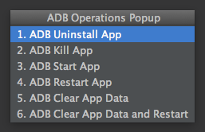
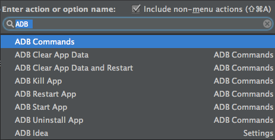

ADB Idea
========

A plugin for Android Studio and Intellij IDEA that speeds up your day to day android development.

The following commands are provided:

* Uninstall App
* Kill App
* Start App
* Restart App
* Clear App Data
* Clear App Data and Restart
* Ezy Login

Usage
=====

Quick Operations Popup
-----------------

The number on the left is a shortcut that will stay the same for your muscle memory pleasure.

* Mac OSX: Ctrl+Shift+A
* Windows/Linux: Ctrl+Alt+Shift+A

Find Actions
-----------------
Each command is prefixed by "ADB", so you can quickly filter through adb commands using the "[Find Actions](http://www.jetbrains.com/idea/webhelp/navigating-to-action.html)" shortcut.

The Menu Way
------------
You can find every command in the following menu:
`Tools->Android->Ezy Login`

Installation
========

Download and install *Ezy Login* directly from Intellij / Android Studio:
`Preferences/Settings->Plugins->Browse Repositories`

Alternatively, you can [download the plugin](http://plugins.jetbrains.com/plugin/7380?pr=idea) from the jetbrains plugin site and install it manually in:
`Preferences/Settings->Plugins->Install plugin from disk`

Adding Accounts to Ezy Login 
========

Goto preference -> otherSettings -> EzyLogin -> Enter Accounts.

After adding accounts select command "Login using stored accounts" where dialog will be shown to select accounts.

After selecting account hit enter. Username and password will be populated on opened emulator/ Device

License
=======

    Copyright 2021 Darshan KG 

    Licensed under the Apache License, Version 2.0 (the "License");
    you may not use this file except in compliance with the License.
    You may obtain a copy of the License at

       http://www.apache.org/licenses/LICENSE-2.0

    Unless required by applicable law or agreed to in writing, software
    distributed under the License is distributed on an "AS IS" BASIS,
    WITHOUT WARRANTIES OR CONDITIONS OF ANY KIND, either express or implied.
    See the License for the specific language governing permissions and
    limitations under the License.
